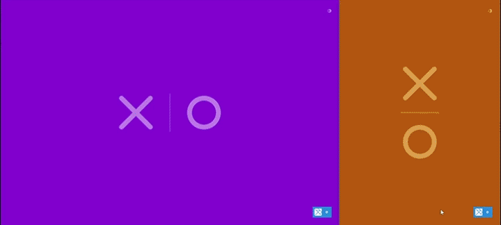

# Tic-Tac-Toe: An Online Experience!

Experimental online game written in Haskell 
([Servant](https://hackage.haskell.org/package/servant)) and 
[Elm](https://elm-lang.org), with [TailwindCSS](https://tailwindcss.com/) 
for styling.

  

